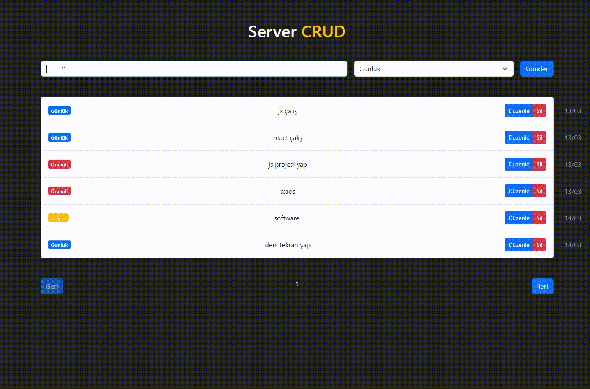

## Server CRUD

- Bu proje basit bir not alma uygulaması içermektedir. Kullanıcılar uygulama aracılığıyla not ekleyebilir, düzenleyebilir ve silebilir. Ayrıca sayfalandırma özelliği ile notları listeleyebilirler.

## Projede kullanılan teknolojiler

- - React: React kütüphanesi kullanıcı arayüzü için kullanılır

- - Axios: Axios kütüphanesi HTTP istekleri için kullanılır

- - Bootstrap: Bootstrap temel stil ve düzen için kullanılır

- - JSON Server: JSON Server, proje için basit bir API sağlamak için kullanılır

## Gif

